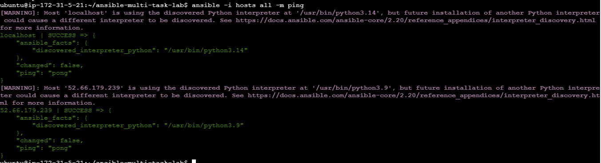
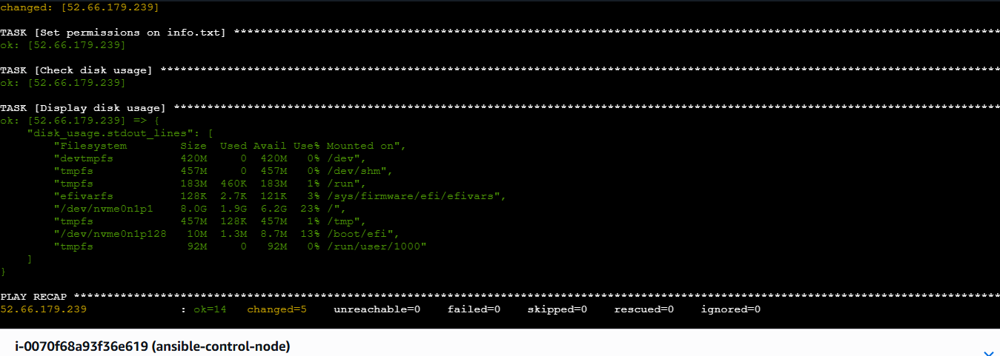
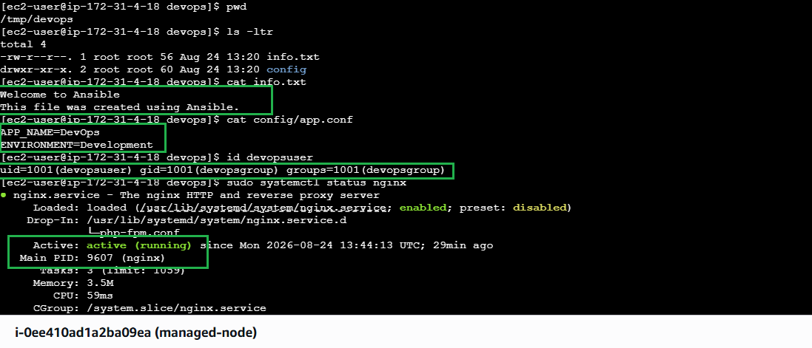
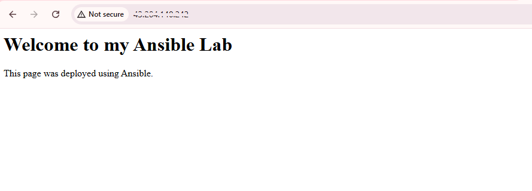
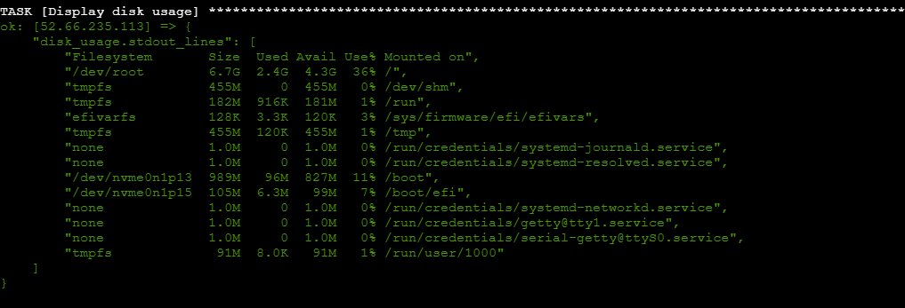
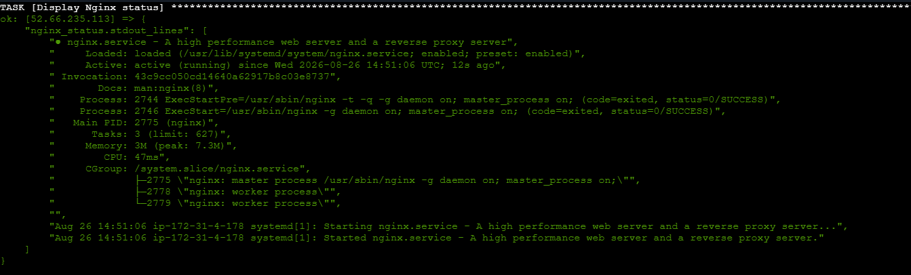
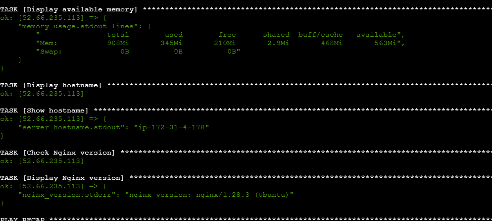
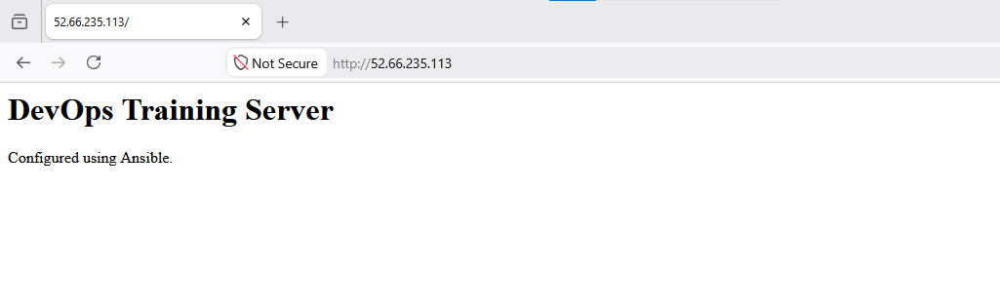

# Ansible Automation Lab – Multi-Task Playbooks
 
## Overview
 
This project is part of my **#AWSDevOpsRestartJourney** — a hands-on effort to rebuild and strengthen my DevOps skills through practical, real-world automation exercises.
 
In this lab, I wrote two Ansible playbooks to automate common server configuration and maintenance tasks: creating directory/file structures, installing and managing Nginx, configuring users and groups, setting permissions, and running basic system health checks — all without logging into the managed nodes manually.
 
---
 
## Tools & Technologies
 
- **Ansible** – Configuration management and automation
- **Nginx** – Web server
- **Ubuntu** – Managed node OS
- **YAML** – Playbook syntax
---
 
## Project Structure
 
```
ansible-multi-task-lab/
├── multi-tasks.yml               # Task Definition 1
├── webserver-maintenance.yml     # Task Definition 2
├── hosts                         # Inventory file
└── README.md
```
 
---

## Prerequisite

### Setting Up the Inventory File
 
An inventory file is a list of the managed nodes (hosts/IPs, grouped and with connection details) that Ansible runs playbooks against.

Before running either playbook, create a `hosts` file in the same directory and add the IP address (or hostname) of your remote managed node(s), along with the SSH connection details Ansible should use to reach them.
 
```ini
[control]
localhost ansible_connection=local
 
[webservers]
<EC2-PUBLIC-IP> ansible_user=<username> ansible_ssh_private_key_file=~/.ssh/id_rsa
 
```
 
- **`[control]`** — represents the Ansible control node itself (the machine you're running these playbooks from). `ansible_connection=local` tells Ansible to run tasks directly on this host instead of connecting over SSH. You typically won't target this group with these playbooks, but it's useful to have listed for reference or for any local-only tasks later.
- **`[webservers]`** — the remote managed node(s) these playbooks actually configure. 
- Replace `<EC2-PUBLIC-IP>` with your remote machine's actual IP address (or a resolvable hostname).
- Replace `<username>` with the SSH login username for that machine (e.g. `ubuntu`, `ec2-user`).
---

### Setting Up Passwordless SSH to the Remote Machine
 
Ansible connects to managed nodes over SSH, so it's best to set up key-based authentication from your control node (the machine running Ansible) to avoid being prompted for a password on every run.
 
1. **Generate an SSH key pair on the control node** (skip if you already have one):
```bash
   ssh-keygen -t rsa -b 4096
```
   Press Enter to accept the defaults (no passphrase is simplest for automation).
 
2. **Copy your public key to the remote machine:**
```bash
   cat ~/.ssh/id_rsa.pub | ssh ubuntu@<ec2-public-ip> "mkdir -p ~/.ssh && cat >> ~/.ssh/authorized_keys"
```
 
3. **Verify passwordless login works:**
```bash
   ssh ubuntu@192.168.1.100
```
   You should be logged in directly, with no password prompt.
 
Once this is set up, reference the same key in your `hosts` file via `ansible_ssh_private_key_file` (see below) so Ansible can authenticate without a password too.
 
Test connectivity before running the playbooks:
 
```bash
ansible -i hosts all -m ping
```
 
A successful `pong` response confirms Ansible can reach and authenticate to your managed node.



---

## Task Definition 1 – `multi-tasks.yml`
 
**Goal:** Automate directory/file creation, install and enable Nginx, manage users/groups, set file permissions, and check disk usage on the managed node (Here I have taken Amazon Linux). 
 
### What it does
- Creates `/tmp/devops` and `/tmp/devops/info.txt` with sample content
- Creates `/tmp/devops/config` and `/tmp/devops/config/app.conf` with app configuration
- Installs, starts, and enables Nginx
- Deploys a custom `index.html` web page on Amazon linux
- Creates a `devopsgroup` group and a `devopsuser` user, and adds the user to the group
- Sets `/tmp/devops/info.txt` permissions to `0644`
- Displays disk usage
### Playbook
 
```yaml
---
- name: Multi-Task Server Setup Playbook
  hosts: webservers
  become: true
 
  tasks:
    - name: Create /tmp/devops directory
      ansible.builtin.file:
        path: /tmp/devops
        state: directory
        mode: '0755'
 
    - name: Create /tmp/devops/info.txt with content
      ansible.builtin.copy:
        dest: /tmp/devops/info.txt
        content: |
          Welcome to Ansible
          This file was created using Ansible.
 
    - name: Create /tmp/devops/config directory
      ansible.builtin.file:
        path: /tmp/devops/config
        state: directory
        mode: '0755'
 
    - name: Create /tmp/devops/config/app.conf with content
      ansible.builtin.copy:
        dest: /tmp/devops/config/app.conf
        content: |
          APP_NAME=DevOps
          ENVIRONMENT=Development
 
    - name: Install Nginx
      ansible.builtin.dnf:
        name: nginx
        state: present
        update_cache: true
 
    - name: Start Nginx service
      ansible.builtin.service:
        name: nginx
        state: started
 
    - name: Enable Nginx to start on boot
      ansible.builtin.service:
        name: nginx
        enabled: true
 
    - name: Deploy custom web page
      ansible.builtin.copy:
        dest: /usr/share/nginx/html/index.html
        content: |
          <html>
          <body>
            <h1>Welcome to my Ansible Lab</h1>
            <p>This page was deployed using Ansible.</p>
          </body>
          </html>
 
    - name: Create devopsgroup group
      ansible.builtin.group:
        name: devopsgroup
        state: present
 
    - name: Create devopsuser and add to devopsgroup
      ansible.builtin.user:
        name: devopsuser
        group: devopsgroup
        state: present
 
    - name: Set permissions on info.txt
      ansible.builtin.file:
        path: /tmp/devops/info.txt
        mode: '0644'
 
    - name: Check disk usage
      ansible.builtin.command: df -h
      register: disk_usage
      changed_when: false
 
    - name: Display disk usage
      ansible.builtin.debug:
        var: disk_usage.stdout_lines

```

### How to Run
 
```bash
# Task Definition 1
ansible-playbook -i hosts multi-tasks.yml
```

Playbook Execution 



Files, Directories and nginx status



Custom webpage created through ansible




## Task Definition 2 – `webserver-maintenance.yml`
 
**Goal:** Automate routine web server maintenance on a managed **Ubuntu** server — package updates, Nginx setup, application directory structure, permissions, and system health checks.
 
### What it does
- Updates the APT package cache
- Installs `nginx`, `curl`, `git`, and `tree`
- Starts and enables Nginx
- Creates `/opt/backups` and `/opt/myapp`
- Creates `/opt/myapp/app.txt` and `/opt/myapp/maintenance.txt` with content
- Deploys a custom Nginx web page
- Sets permissions on `/opt/myapp`, `app.txt`, and `maintenance.txt`
- Verifies Nginx status, disk usage, memory, hostname, and Nginx version
### Playbook
 
```yaml
---
- name: Webserver Maintenance Playbook
  hosts: ubuntu_servers
  become: true
 
  tasks:
    - name: Update APT package cache
      ansible.builtin.apt:
        update_cache: true
 
    - name: Install required packages
      ansible.builtin.apt:
        name:
          - nginx
          - curl
          - git
          - tree
        state: present
 
    - name: Start Nginx service
      ansible.builtin.service:
        name: nginx
        state: started
 
    - name: Enable Nginx to start on boot
      ansible.builtin.service:
        name: nginx
        enabled: true
 
    - name: Create backup directory
      ansible.builtin.file:
        path: /opt/backups
        state: directory
        mode: '0755'
 
    - name: Create application directory
      ansible.builtin.file:
        path: /opt/myapp
        state: directory
        mode: '0755'
 
    - name: Create application file with content
      ansible.builtin.copy:
        dest: /opt/myapp/app.txt
        content: |
          My Application
          Version: 1.0
          Environment: Production
        mode: '0644'
 
    - name: Create maintenance file with content
      ansible.builtin.copy:
        dest: /opt/myapp/maintenance.txt
        content: |
          Server configured and maintained using Ansible.
        mode: '0644'
 
    - name: Deploy custom Nginx web page
      ansible.builtin.copy:
        dest: /var/www/html/index.html
        content: |
          <html>
          <body>
            <h1>DevOps Training Server</h1>
            <p>Configured using Ansible.</p>
          </body>
          </html>
 
    - name: Set permissions on /opt/myapp
      ansible.builtin.file:
        path: /opt/myapp
        mode: '0755'
 
    - name: Set permissions on app.txt
      ansible.builtin.file:
        path: /opt/myapp/app.txt
        mode: '0644'
 
    - name: Set permissions on maintenance.txt
      ansible.builtin.file:
        path: /opt/myapp/maintenance.txt
        mode: '0644'
 
    - name: Check Nginx status
      ansible.builtin.command: systemctl status nginx
      register: nginx_status
      changed_when: false
 
    - name: Display Nginx status
      ansible.builtin.debug:
        var: nginx_status.stdout_lines
 
    - name: Check disk usage
      ansible.builtin.command: df -h
      register: disk_usage
      changed_when: false
 
    - name: Display disk usage
      ansible.builtin.debug:
        var: disk_usage.stdout_lines
 
    - name: Check available memory
      ansible.builtin.command: free -h
      register: memory_usage
      changed_when: false
 
    - name: Display available memory
      ansible.builtin.debug:
        var: memory_usage.stdout_lines
 
    - name: Display hostname
      ansible.builtin.command: hostname
      register: server_hostname
      changed_when: false
 
    - name: Show hostname
      ansible.builtin.debug:
        var: server_hostname.stdout
 
    - name: Check Nginx version
      ansible.builtin.command: nginx -v
      register: nginx_version
      changed_when: false
 
    - name: Display Nginx version
      ansible.builtin.debug:
        var: nginx_version.stderr
```
 
> **Note on managed node OS:** `multi-tasks.yml` (Task Definition 1) targets **Amazon Linux** and uses the `dnf` module with the `/usr/share/nginx/html` docroot. `webserver-maintenance.yml` (Task Definition 2) targets **Ubuntu** and uses the `apt` module with the `/var/www/html` docroot, as above. Make sure your `hosts` inventory file points each playbook at a managed node running the matching OS — running `apt` tasks against Amazon Linux (or `dnf` tasks against Ubuntu) will fail, since neither package manager exists on the other distro.
> Also add inventory name as `ubuntu_servers` in `hosts` file after adding control node id_rsa key to
 
## ▶️ How to Run
 
```bash
# Task Definition 2
ansible-playbook -i hosts webserver-maintenance.yml
```

### Screenshots
 Ansible displays Disk Usage of managed node server.



Display Nginx status


 
Check available memory, hostname, nginx version.


Final nginx webserver page on browser


---

## Key Learnings
 
- Structuring multi-task playbooks with clear, single-responsibility tasks
- Managing files, directories, and permissions declaratively with Ansible modules
- Installing and managing services (Nginx) with `apt`/`dnf` and `service` modules across different Linux distros
- Creating users/groups and controlling access with Ansible
- Running and capturing ad-hoc system commands (`df`, `free`, `hostname`, `nginx -v`) with `command` + `debug`/`register`

---

## Author

**Sinsha C**

[](https://github.com/sinsha-c)
[](https://linkedin.com/in/sinshac)
 
  